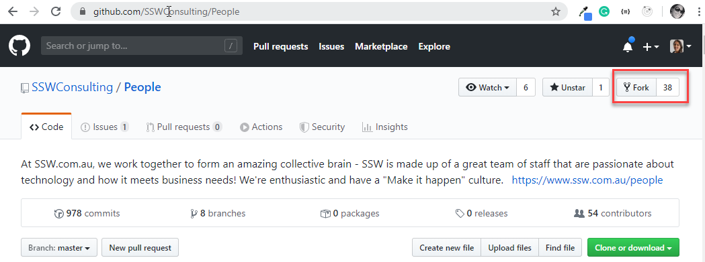
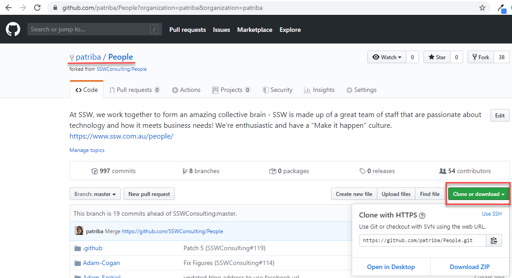
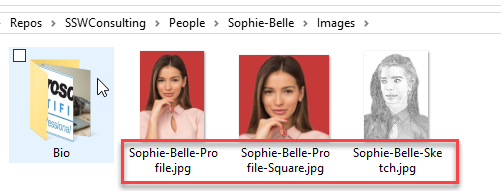
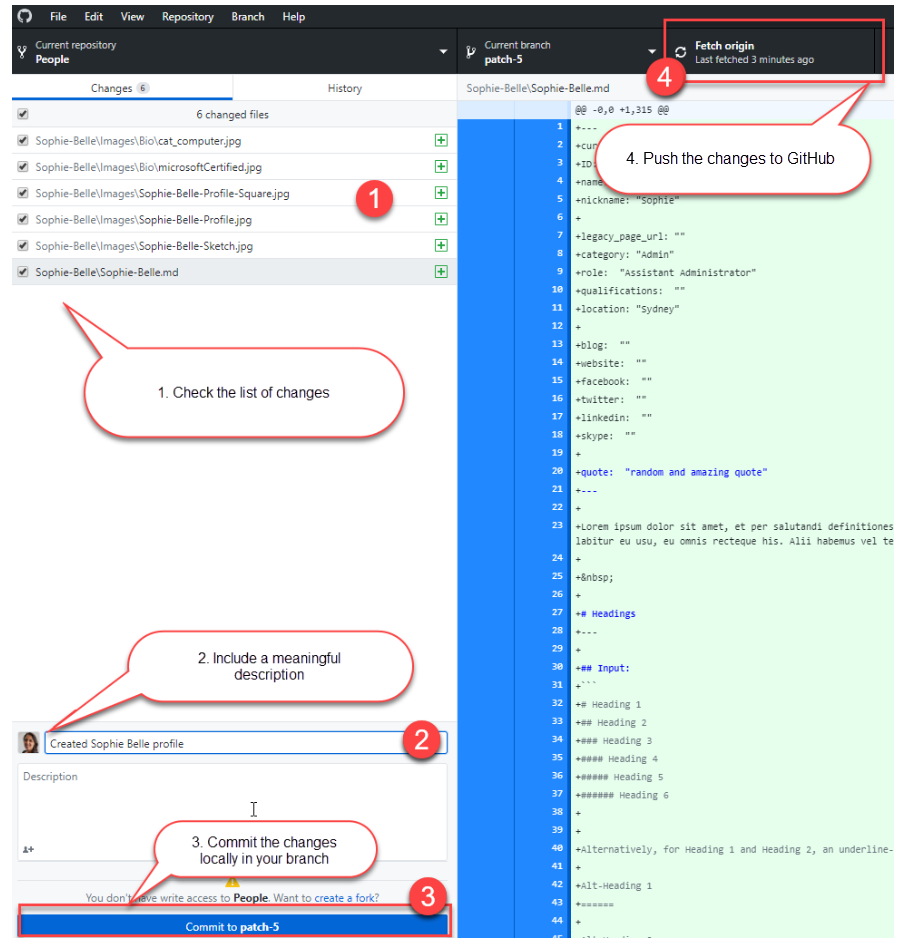

# People
Welcome to People.SSW ! 
All SSW Profiles have been automatically migrated from our previous iteration (hosted on SharePoint) and therefore might not be optimized. Please, feel free to fix typos and styling mistakes.

These markdown files are used by our Gatsby static site generator to generate https://people.ssw.com.au/

Gatsby generator project: https://github.com/SSWConsulting/people.ssw.com.au/

Sample Profile: https://www.ssw.com.au/people/bob-northwind

# Instructions 

## How to create a new profile

1. Create user profile in CRM or ensure that you user profile is created in CRM - https://live.crm.ssw.com.au/main.aspx#

   
**Figure: CRM Users List**

If your name is not in the list click in **+ New**

   
**Figure: Creating User in CRM**

2. Fork the repository SSWConsulting/People - Branch: **master**

   
**Figure: Forking Repository**

3. Clone your forked repository

> Hint: You can use [GitHub Desktop] (https://desktop.github.com/)

   
**Figure: Cloning the repository**

4. Copy/Paste **"Bob Northwind"** Profile folder using Windows Explorer

   
**Figure: Copying / Pasting the folder using Windows Explorer**

5. Change folder and file names to match user’s **Firstname-Lastname** identifier
    * **Firstname-Lastname** need to be identical to CRM data

     
**Figure: Changing folder name**

   
**Figure: Changing profile file name**

   
**Figure: Replacing images with your company profile images**

6. Open Firstname-Lastname.md file and update profile information

   
**Figure: Opening / Updating profile**

7. Commit your changes

   
**Figure: Committing changes**

8. Click "Create Pull Request"

 
**Figure: Creating pull request (PR)**

> Todo: Improve user experience (automation)

## How to edit your profile on GitHub

1. Find your folder from the root
2. Navigate to [Firstname]-[Lastname].md
3. Make your changes

> Hint: you can use https://github.com/adam-p/markdown-here/wiki/Markdown-Cheatsheet if you are not familiar with Markdown

## How to add images on GitHub

1. Navigate to your profile folder
2. Navigate to /People/[Firstname]-[Lastname]/Images/Bio

 
**Figure: Uploading new files**

3. Reference the images in your Bio using  ``` ```

> Important: Avoid spaces in filenames, use hyphens instead

## Set images sizes

Our Markdown processor uses custom Markups to extend markdown capabilities on image styling. Images added to your profile can be defined as :
- "Badge" - inline fixed 135px maximum width
- "Small" - fixed 200px maximum width
- "Medium" - fixed 400px maximum width
- "Large" - no maximum width

To assign one those predefined styles to an image, use the following syntax:

```
[[Custom_Style_Code]]
| 
```

Example: 

``` 
[[imgBadge]]
|  
```

Available styles :

| Style name | Code     | Inline | Image max-width |
| ---------- | -------- | ------ | --------------- |
| Badge      | imgBadge | true   | 135px           |
| Small      | imgSm    | false  | 200px           |
| Medium     | imgMd    | false  | 400px           |
| Large      | imgLg    | false  | none            |

## How to publish your changes 

1. Navigate to your markdown profile
2. Click "Edit"

 
**Figure: Enabling edit mode in GitHub**

3. Make your changes
4. Click "Propose File Change" 

> Important: Please add a description for your changes so reviewers have context when approving your changes

 
**Figure: Saving changes**

5. Click "Create Pull Request"

 
**Figure: Creating pull request (PR)**

